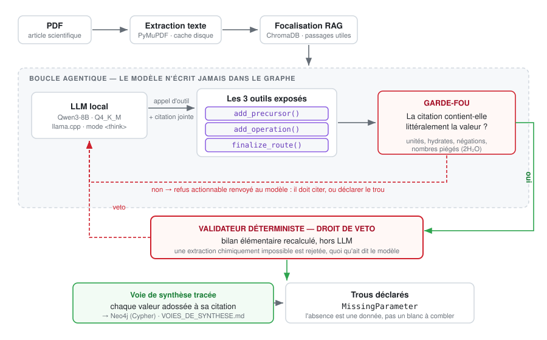

# SynthGraph — extraction vérifiable de voies de synthèse par tool-calling


-6E40C9)


[](https://github.com/SupperTerryble/SynthGraph/actions/workflows/tests.yml)

Un PDF scientifique entre, une voie de synthèse **vérifiable** en sort.

**La règle du projet, non négociable : le système n'invente RIEN.** Chaque valeur
entre dans le graphe par un appel d'outil qui la **refuse** si la citation
fournie ne la contient pas. Un paramètre absent du papier n'est jamais deviné :
il devient un trou déclaré (`MissingParameter`).

---

## L'architecture

<p align="center">
  
</p>

Trois idées portent tout le système :

1. **Le modèle n'écrit pas dans le graphe** — il appelle trois outils
   (`add_precursor`, `add_operation`, `finalize_route`) qui refusent tout
   argument non prouvé par la citation jointe, et lui renvoient un refus
   *actionnable* : cite, ou déclare le trou.
2. **Un validateur déterministe a un droit de veto** — le bilan élémentaire
   recalculé hors LLM refuse une extraction chimiquement impossible, quoi
   qu'ait dit le modèle.
3. **Le trou est une donnée** — l'absence est déclarée (`MissingParameter`),
   jamais comblée par une valeur plausible.

## Le résultat en une table

Même modèle (Qwen3-8B quantifié Q4_K_M, exécuté en local), deux architectures :

| Papier | Précurseurs | Températures | Traçabilité | Reproductible |
|---|---|---|---|---|
| *single-shot* (départ) | — | 37,5 % | **22,6 %** | 1 voie / 3 |
| crystal (tool-calling) | 100 % | **100 %** | 95,4 % (108 valeurs) | presque |
| physrev (tool-calling) | 100 % | 100 % | **100 %** | **oui** |
| prepara — OCR de 1957 (tool-calling) | **100 %** | 100 % | **100 %** | **oui** |

Le gain vient de l'**architecture** (outils contraints + validation déterministe
avec droit de veto), pas d'un modèle plus gros : un MoE 35B-A3B fait **pire**
(33 % de précurseurs).

Corpus étendu : **8 papiers, 6 familles de synthèse** (flux, céramique,
hydrothermale, sol-gel, auto-combustion, bain chimique, réduction chimique).
Gold annoté à la main : 89 contrôles, 0 erreur.

## Tests

```bash
pip install -r requirements-tests.txt          # léger : ni torch, ni GPU
python tests/regression/run_all.py
```

**56 suites, 835 assertions**, hors ligne, en une trentaine de secondes.
Trois suites supplémentaires confrontent le gold aux *textes sources* des
papiers : ces textes sont des articles sous copyright, non versionnés, donc
ces suites ne tournent qu'en local et sont écartées nommément en CI —
`run_all.py` les annonce dans son bilan, pour qu'un vert ne puisse pas mentir
sur ce qui a réellement tourné.

## Installation

```bash
git clone https://github.com/SupperTerryble/SynthGraph.git
cd SynthGraph
pip install -r requirements.txt
export MODELS_DIR=/chemin/vers/vos/modeles/gguf
export NEO4J_PASSWORD=...          # optionnel : export du graphe vers Neo4j
```

> Les PDF sources et les modèles GGUF ne sont pas versionnés (copyright / taille).
> Les annotations gold, elles, sont dans `data/gold/`.

---

## Démarrer

```bash
# Extraire et confronter au gold — les 3 iridates
python tools/compare_tc_gold.py --model Qwen3-8B-Q4_K_M.gguf

# Les 5 papiers hors iridates
python tools/compare_tc_gold.py --model Qwen3-8B-Q4_K_M.gguf \
    --papers hydro_czts,solgel_cuo,combu_ferrite,cbd_mnse,reduc_cu \
    --gold data/gold/gold_corpus5.json

# « Puis-je refaire la synthèse au laboratoire ? » — la question du chimiste
python tools/audit_reproductibilite.py

# Non-régression (hors ligne, sans GPU, ~3 min)
python tests/regression/run_all.py
```

> Sous Windows, pensez à `PYTHONIOENCODING=utf-8`.

---

## Comment lire ce dépôt

| Vous cherchez… | Allez voir |
|---|---|
| l'historique complet et les leçons apprises | `README_AUTONOME.md` |
| le mandat et les décisions déjà arbitrées | `MANDAT.md` |
| les consignes de travail | `CLAUDE.md` |
| ce que le pipeline a extrait, voie par voie, avec les preuves | `VOIES_DE_SYNTHESE.md` |

### Le code

| Rôle | Fichier |
|---|---|
| **Les 3 outils exposés au modèle** (add_precursor, add_operation, finalize_route) et TOUS les garde-fous | `synthgraph/extraction/graph_tools.py` |
| La boucle agentique (formats d'appel, mode `<think>`, élagage d'historique) | `synthgraph/agents/extractor_toolcalling.py` |
| Le contrat de chaque type d'opération (colonnes requises, trous déclarés) | `synthgraph/schemas/step_schema.py` |
| Le bilan élémentaire déterministe — **il a un droit de veto** | `synthgraph/validation/deterministic.py` |
| Pipeline complet (single-shot, QA, Cypher) | `synthgraph/pipeline/runner.py` |

### Les outils

| Outil | Ce qu'il fait |
|---|---|
| `compare_tc_gold.py` | extrait puis confronte au gold annoté à la main |
| `audit_reproductibilite.py` | la synthèse est-elle **refaisable** ? (réactifs, proportions, séquence, atmosphère, contenant, traitement final) |
| `make_voies_doc.py` | produit `VOIES_DE_SYNTHESE.md` : une partie par voie, chaque valeur avec sa citation |
| `build_text_cache.py` | pré-extrait le texte des PDF (lent, mis en cache) |
| `recompute_corpus5.py` | recalcule les métriques sans relancer le GPU |
| `triage_corpus.py` | classes d'échec sur un batch |

### Les données

- `data/gold/` — les références **annotées à la main**, vérifiées contre les textes
  sources (89 contrôles, 0 erreur sur le corpus5).
- `data/bench_night/`, `data/corpus5/` — les PDF.
- `logs/odl_*.txt` — cache des textes extraits.
- `logs/pathways_Qwen3_*.json` — dernières extractions.
- `logs/chroma_db_bible/` — **ne pas supprimer**, base vectorielle persistante.
- `logs/archives_runs/` — historique des campagnes.

---

## Les tests de non-régression

`tests/regression/` garde un test par correctif livré, et **un test par piège
rencontré sur données réelles** :

- une fuite d'exemple de prompt (`equipment='bécher'` recopié d'un prompt
  français dans un papier anglais) ;
- une atmosphère niée (« without inert gas protection ») ;
- un flacon de **stockage** pris pour un réacteur ;
- un sonicateur de marque (« VialTweeter ») pris pour un contenant ;
- un hydrate `Fe(NO3)2.9H2O` lu comme un décimal, qui corrompait le bilan
  élémentaire — donc le **veto** ;
- un « 2 » trouvé dans `2H2O` et pris pour une quantité.

Ces suites vivaient dans un dossier temporaire de session jusqu'au 20/08 : un
nettoyage les aurait effacées.

---

## Ce que le pipeline sait faire, et ce qu'il ne sait pas

Il extrait, sur 8 papiers de 6 familles de synthèse (flux, céramique,
hydrothermale, sol-gel, auto-combustion, bain chimique, réduction chimique) :
précurseurs, ratios, séquences thermiques, atmosphère, contenant par opération,
étapes de traitement final — **chaque valeur adossée à sa citation**.

Il ne devine pas. Quand un papier ne nomme aucun récipient, aucune proportion ou
aucune atmosphère, le pipeline s'abstient et déclare le trou. Plusieurs
« échecs » apparents relèvent de cette limite des **sources**, pas du système.
